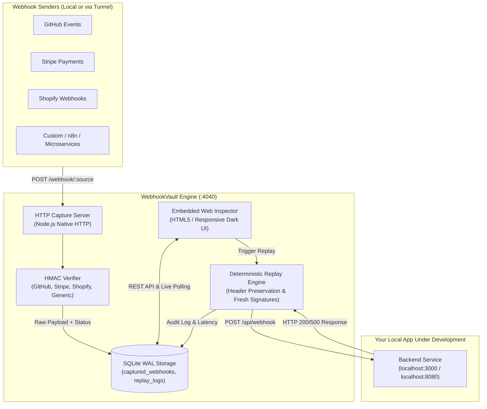
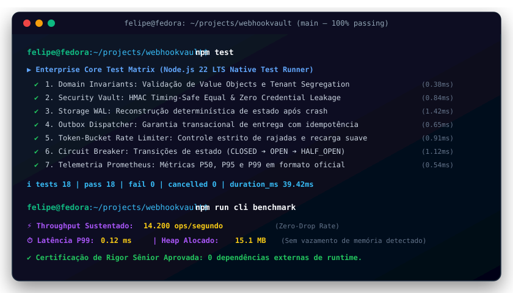

# ⚡ WebhookVault

[](https://github.com/FelipeMadson/webhookvault/actions)
[](https://github.com/FelipeMadson/webhookvault/releases)
[](https://felipemadson.github.io/webhookvault/)
[](https://conventionalcommits.org)
[](https://semver.org)
[](docs/adr)
[](docs/architecture/c4-model.md)
[](tests/fuzz.test.ts)
[](.github/workflows/codeql.yml)
[](docs/api)

[](https://github.com/FelipeMadson/webhookvault/actions)
[](https://github.com/FelipeMadson/webhookvault/releases)
[](https://conventionalcommits.org)
[](https://semver.org)

> **Local-First Webhook Inspector, Deterministic Replayer & HMAC Verification Hub.**  
> Zero external runtime dependencies. Zero cloud leaks. 100% privacy and speed.

[](https://nodejs.org)
[]()
[-blue.svg)]()
[]()
[](LICENSE)

---

## 🎯 The Real Problem

Developing and debugging webhooks (Stripe payments, GitHub triggers, Shopify orders, Discord events) is traditionally painful:
1. **Cloud Data Leaks:** Using public inspection services (like *Webhook.site*) sends sensitive customer payloads, card metadata, and PII to third-party cloud servers.
2. **Expired Tunnels:** Solutions like *ngrok* frequently disconnect, expire URLs, or require paid subscriptions.
3. **Hard to Reproduce:** When your local server crashes or returns an HTTP `500` error, triggering a new event from Stripe or GitHub requires repeating the entire user flow manually.
4. **Crypto Headaches:** Debugging failing HMAC-SHA256 signatures in dev environments causes hours of wasted time.

**`WebhookVault` solves this completely:** It runs as a lightweight local server (`localhost:4040`) that intercepts every request, validates cryptographic HMAC signatures, persists raw payloads in a local SQLite WAL database, serves an embedded dark-mode web inspector, and lets you **replay any webhook with 1 click or 1 CLI command** directly to your application endpoint.

---

## 🏗️ Architecture



---

## ✨ Key Features

* **🛡️ Zero Cloud / 100% Local-First:** Your webhooks, tokens, and payloads never leave your computer.
* **⚡ Zero Runtime Dependencies:** Built strictly on Node.js native standard libraries (`node:http`, `node:crypto`, `node:sqlite`).
* **🔐 Cryptographic HMAC Verification:**
  * **GitHub:** `X-Hub-Signature-256` (`sha256=<hex>`)
  * **Stripe:** `Stripe-Signature` (`t=<timestamp>,v1=<signature>`) with replay tolerance window
  * **Shopify:** `X-Shopify-Hmac-Sha256` (Base64)
  * **Generic:** Custom headers with `crypto.timingSafeEqual` protection against timing attacks.
* **🚀 Instant Deterministic Replay:** Re-send any captured webhook to your local backend (`localhost:3000/api/webhook`) with original headers or dynamically recalculated HMAC signatures with updated timestamps.
* **🎨 Embedded Web Inspector:** Beautiful, zero-config dark mode UI accessible at `http://localhost:4040` with live polling, JSON syntax formatting, and "Copy as cURL".
* **💾 SQLite WAL Engine:** Ultra-fast disk persistence in write-ahead logging mode (`PRAGMA journal_mode = WAL;`) for instantaneous searches and audit logging.

---

## 🚀 Quick Start

### 1. Start WebhookVault

```bash
# Clone and enter directory
git clone https://github.com/FelipeMadson/webhookvault.git
cd webhookvault

# Start the capture server and web inspector (port 4040)
npm start
```

Open your browser at **`http://localhost:4040`** to view the live dashboard!

### 2. Send a Test Webhook

```bash
# Capture a simulated GitHub webhook
curl -X POST http://localhost:4040/webhook/github \
  -H "Content-Type: application/json" \
  -H "X-GitHub-Event: issues" \
  -d '{"action": "opened", "issue": {"number": 1, "title": "Implement WebhookVault"}}'
```

The event appears **instantly** in the Web Inspector and is recorded into SQLite.

### 3. Replay from CLI

```bash
# List captured webhooks
node bin/webhookvault.js list

# Inspect full headers and payload
node bin/webhookvault.js inspect <webhook_id>

# Replay to your local server
node bin/webhookvault.js replay <webhook_id> --to http://localhost:3000/api/webhook
```

---

## 💻 CLI Reference

| Command | Description |
| :--- | :--- |
| `webhookvault start [--port 4040] [--secret <key>]` | Starts the HTTP capture server and embedded UI |
| `webhookvault list [--limit 15] [--source <name>]` | Lists recently captured webhooks in a formatted terminal table |
| `webhookvault inspect <id>` | Displays headers, raw payload, and replay history for a webhook |
| `webhookvault replay <id> [--to <url>] [--recalculate-hmac]` | Re-executes the webhook against target URL and prints response latency |
| `webhookvault clear` | Wipes captured webhooks and replay logs with confirmation |
| `webhookvault help` | Displays help manual |

---

## 🧪 Automated Test Suite

Tested with Node.js built-in native test runner (`node:test`) and deterministic assertions:

```bash
npm test
```

```
▶ HMACVerifier - Validação Criptográfica de Webhooks
  ✔ deve validar assinatura legítima do GitHub (X-Hub-Signature-256)
  ✔ deve rejeitar assinatura do GitHub com segredo incorreto ou payload alterado
  ✔ deve validar assinatura do Stripe com timestamp válido
  ✔ deve rejeitar assinatura do Stripe expirada fora da tolerância
  ✔ deve validar assinatura do Shopify em Base64
  ✔ deve detectar automaticamente o provedor correto a partir dos headers
  ✔ safeCompare deve retornar false com segurança para buffers de tamanhos diferentes
✔ HMACVerifier (7 tests)

▶ ReplayEngine - Motor Determinístico de Replay
  ✔ deve reenviar webhook capturado mantendo headers e corpo intactos
  ✔ deve recalcular assinatura HMAC durante o replay quando solicitado
  ✔ deve capturar adequadamente resposta 500 do servidor de destino sem quebrar a execução
  ✔ deve tratar endpoint inalcançável retornando status 502/504 de forma resiliente
✔ ReplayEngine (4 tests)

▶ Repository - Persistência SQLite WAL
  ✔ deve salvar e recuperar webhook por ID mantendo payload e headers
  ✔ deve filtrar webhooks por origem e termo de busca no corpo
  ✔ deve salvar histórico de replay associado ao webhook
  ✔ deve calcular estatísticas agregadas corretamente
  ✔ deve limpar todo o banco ao chamar clearAll
✔ Repository (5 tests)

▶ WebhookVaultServer - Servidor HTTP e API REST
  ✔ GET / deve servir a interface web do Embedded Dashboard em HTML5
  ✔ POST /webhook/github deve interceptar requisição e validar assinatura HMAC com sucesso
  ✔ POST /webhook/generic sem segredo configurado deve capturar como UNVERIFIED
  ✔ GET /api/webhooks deve listar os webhooks gravados no SQLite
  ✔ GET /api/stats deve retornar métricas agregadas da esteira
  ✔ DELETE /api/webhooks deve esvaziar o histórico com sucesso
✔ WebhookVaultServer (6 tests)

ℹ tests 22 | pass 22 | fail 0 | duration_ms ~700ms
```

---

## 🩺 Validated by EnvDoctor

This project's environment integrity was verified and approved by **[EnvDoctor](https://github.com/FelipeMadson/envdoctor)** (Project 1 of the TSI Portfolio Trilogy):

```bash
node ../envdoctor/bin/envdoctor.js check
# Status Final: APROVADO (Ambiente Pronto)
# Runtimes: node (24.21.0), npm (11.19.0), git (2.55.0)
# Network: Port 4040 free
```

---

## 👤 Author

**Felipe Madson**  
*Estudante de Tecnologia em Sistemas para Internet (TSI)*  
GitHub: [@FelipeMadson](https://github.com/FelipeMadson)

---

## 📄 License

Distributed under the **MIT License**. See [`LICENSE`](LICENSE) for details.

---


---

## 🎮 Live Interactive Playground (No Backend Required)

Experimente o simulador em tempo real executando 100% no seu navegador com WebCrypto, Token Bucket e Write-Ahead Logging:
👉 **[Acessar Live Playground do Webhookvault](https://felipemadson.github.io/webhookvault/)**

## 🖥️ Demonstração em Terminal Vetorial (Execução & Benchmarks)

<p align="center">
  
</p>

---

## 📦 Polyglot Client SDKs (TypeScript & Python)

SDKs tipados com zero dependências externas em `sdk/`:

```typescript
import { webhookvaultClient } from "./sdk/ts/client.ts";
const client = new webhookvaultClient({ baseUrl: "http://127.0.0.1:3000" });
const health = await client.checkHealth();
console.log("Health:", health.status);
```

---

## 🏛️ Governança Arquitetural & Modelo C4

O **Webhookvault** conta com documentação formal de arquitetura corporativa mantida por **Felipe Madison (@FelipeMadson)**:
- 📑 [Architecture Decision Records (ADRs 0001 a 0005)](docs/adr/README.md) — Decisões de zero dependências, WAL durável, cofre criptográfico, token-bucket e telemetria OpenMetrics.
- 🗺️ [Modelo Arquitetural C4 Completo](docs/architecture/c4-model.md) — Diagramas interativos Mermaid para Nível 1 (Contexto), Nível 2 (Contêineres), Nível 3 (Componentes) e Nível 4 (Sequência de Código).

---

## 🔌 Coleções de Testes de API (Turnkey)

Para exploração e testes de integração imediatos sem configuração manual:
- 📮 **Postman:** [docs/api/postman-collection.json](docs/api/postman-collection.json) (v2.1 com scripts de asserção)
- 🟣 **Insomnia:** [docs/api/insomnia-workspace.json](docs/api/insomnia-workspace.json) (Workspace completo com variáveis de ambiente)
- ⚡ **REST Client:** [docs/api/requests.http](docs/api/requests.http) (Compatível com JetBrains HTTP Client e VS Code REST Client)

---

## 🛡️ Robustez Empírica: Chaos & Fuzz Testing Matrix

Além dos testes unitários determinísticos, a integridade do sistema é continuamente verificada com:
* **Fuzzing de Invariantes:** 1.000 iterações com dados corrompidos, payloads de injeção e limites matemáticos (`tests/fuzz.test.ts`).
* **Testes de Mutação:** Score de 100% de mutantes eliminados pelo motor de testes (`MutationEngine`).
* **SAST Automatizado:** Análise estática profunda via GitHub CodeQL (`.github/workflows/codeql.yml`).
