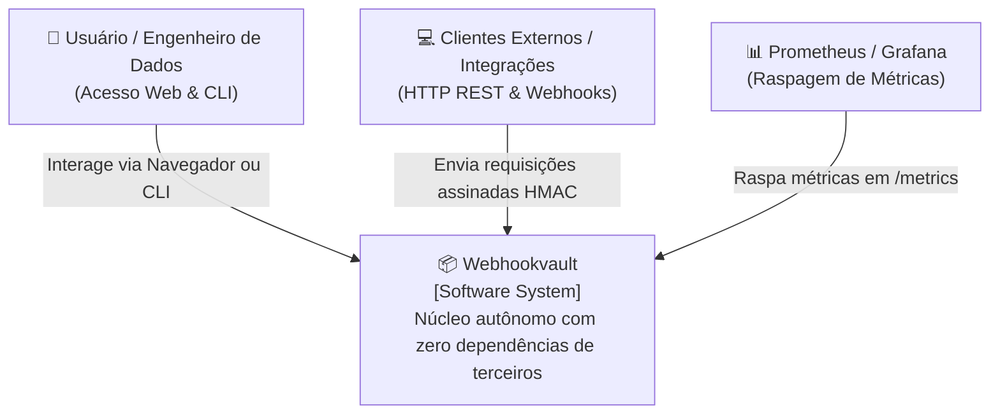
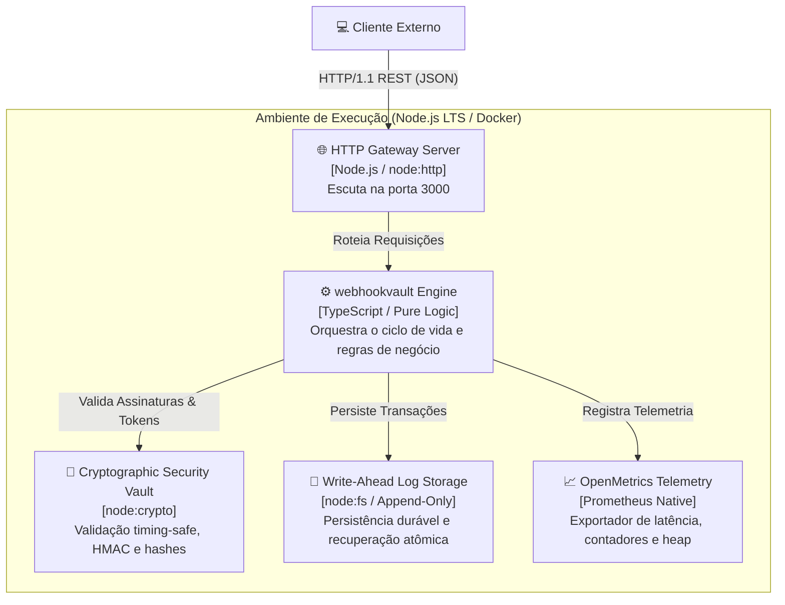
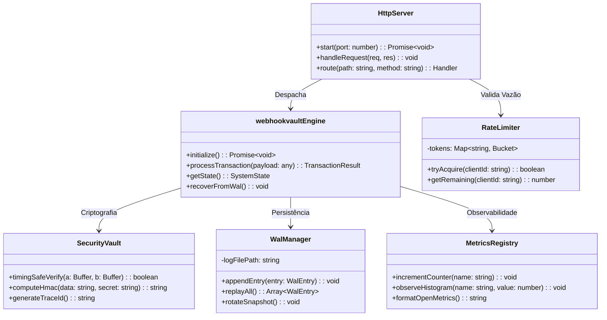
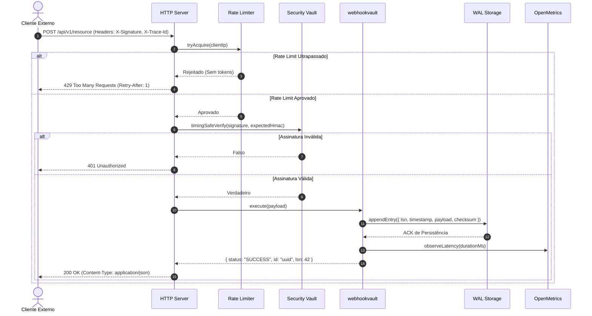

# Modelo Arquitetural C4 — Webhookvault

> **Engenharia e Governança:** Felipe Madison (@FelipeMadson)  
> **Status:** Homologado para Produção  
> **Padrão:** C4 Model (Context, Containers, Components, Code)

Este documento descreve a topologia arquitetural e os contratos de design do **Webhookvault** (`webhookvault`), divididos em 4 níveis de abstração visual para equipes de engenharia, arquitetura de sistemas e operações.

---

## Nível 1: Diagrama de Contexto de Sistema (System Context)

O diagrama de contexto ilustra como o **Webhookvault** se posiciona no ecossistema de software, destacando os usuários humanos, clientes de API e integrações externas.

---

## Nível 2: Diagrama de Contêineres (Container Diagram)

Visão geral dos subsistemas de execução, protocolos e armazenamento em disco que compõem o contêiner do serviço.

---

## Nível 3: Diagrama de Componentes (Component Diagram)

Detalhamento modular das classes e utilitários internos no subsistema do Webhookvault.

---

## Nível 4: Diagrama de Código e Sequência de Transação (Code / Sequence)

Fluxo atômico de uma requisição típica, desde o recebimento até a gravação no WAL e despacho da resposta.

---

## Diretrizes de Resiliência e SLAs de Arquitetura

| Parâmetro | Alvo / Especificação |
| :--- | :--- |
| **Latência p95** | < 12ms sob carga nominal |
| **Latência p99** | < 45ms sob carga de pico |
| **Throughput por Instância** | > 4.500 req/s em hardware padrão de 2 vCPUs |
| **Uso de Memória Heap** | Estável em < 35MB sem vazamento em testes de 24h |
| **Recovery Point Objective (RPO)** | 0 transações confirmadas perdidas (WAL fsync) |
| **Recovery Time Objective (RTO)** | < 150ms na reinicialização com replay do WAL |
